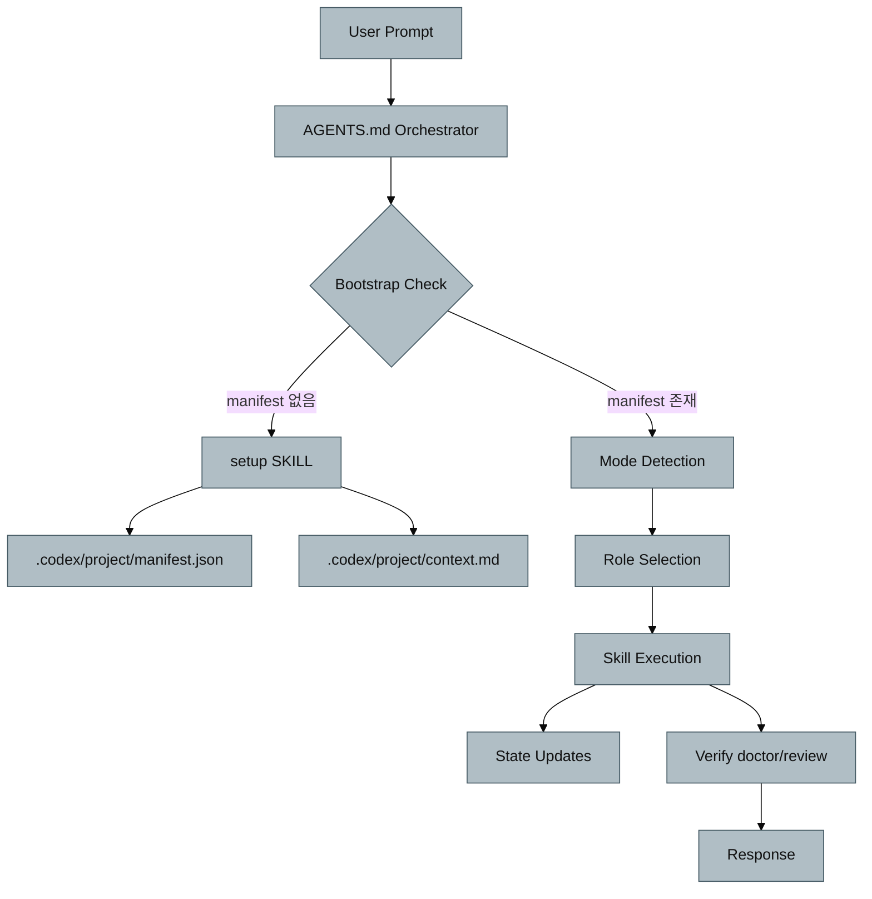

# 아키텍처

## 개요

이 저장소는 실행 앱이 아니라, Codex CLI 작업을 조율하는 규칙/스킬 아키텍처입니다.
구조는 3개 레이어로 분리됩니다.

- 규칙 레이어: `AGENTS.md`, `.codex/AGENTS.md`
- 실행 레이어: `.agents/skills/*/SKILL.md`
- 상태 레이어: `.codex/project/*`

## 시스템 흐름

## 레이어 상세

### 규칙 레이어

- `AGENTS.md`
  - Bootstrap Check
  - Mode Detection
  - Agent Roles 정의
  - Workflows 정의
- `.codex/AGENTS.md`
  - `.codex` 하위 포맷/수정 규칙
  - `.cursor` 마이그레이션 매핑

### 실행 레이어

- `.agents/skills/{name}/SKILL.md`
  - frontmatter(`name`, `description`, `source`) 기반 계약
  - 필요 시 `scripts/`, `references/`, `assets/` 연계
- Core 스킬 4개
  - `code-accuracy`, `verify-loop`, `planning`, `git-commit`

### 상태 레이어

- `.codex/project/VERSION`
- `.codex/project/manifest.json.template`
- `.codex/project/state/`
- setup 이후 생성 대상
  - `.codex/project/manifest.json`
  - `.codex/project/context.md`

## 의존성 방향

1. 오케스트레이터는 스킬을 참조합니다.
2. 스킬은 상태 파일(`context.md`, `state/*`)을 읽고 갱신합니다.
3. doctor는 전체 무결성을 교차 검증합니다.

## 구조적 특성

- 단일 에이전트 + 역할 전환
- 키워드 트리거 기반 실행 전략 선택
- setup 전/후 상태를 명시적으로 분리
