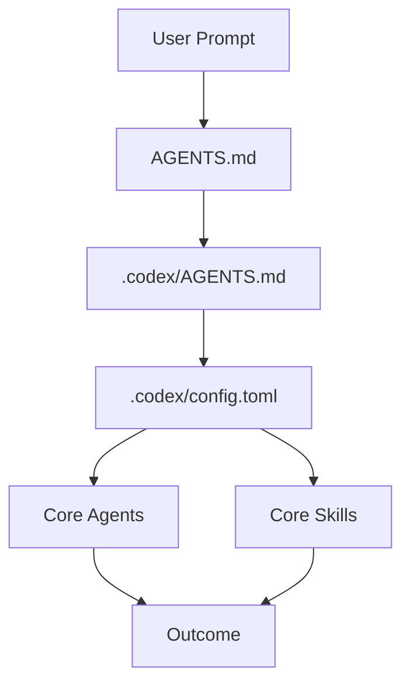

# 아키텍처

## 개요

이 저장소는 실행 앱이 아니라, Codex CLI에서 사용하는 지침/설정 템플릿입니다.

현재 기본 구조는 3개 레이어입니다.

- 규칙 레이어: `AGENTS.md`, `.codex/AGENTS.md`
- 설정 레이어: `.codex/config.toml`, `.codex/agents/*.toml`
- 확장 레이어: `.codex/skills/*`, `.codex/agents/extensions/*`

## 현재 흐름

```mermaid
flowchart TD
    U[User Prompt] --> A[AGENTS.md]
    A --> C[.codex/AGENTS.md]
    C --> CFG[.codex/config.toml]
    CFG --> R[Core Agents]
    CFG --> S[Core Skills]
    R --> O[Outcome]
    S --> O
```

## 설계 원칙

- 기본 규칙은 짧게 유지
- 기본 동작은 단순하게 유지
- 확장 역할과 고급 워크플로우는 opt-in
- 존재하지 않는 커스텀 파일을 기본 전제로 두지 않음
