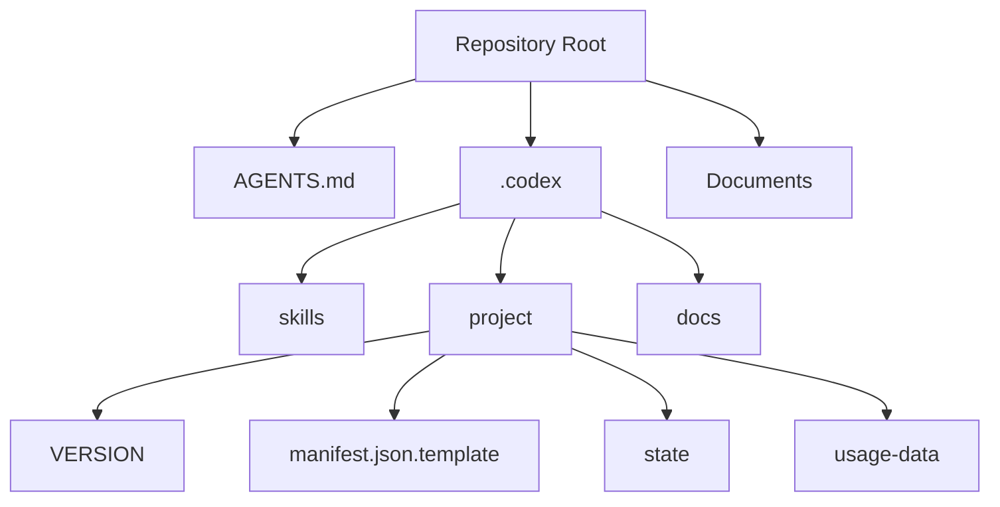

# 폴더 구조

## 루트 디렉터리

```text
.
├── AGENTS.md
├── README.md
├── Documents/
└── .codex/
```

## .codex 상세

```text
.codex/
├── AGENTS.md
├── config.toml.template
├── docs/
│   └── codex-reference.md
├── project/
│   ├── VERSION
│   ├── manifest.json.template
│   ├── state/
│   │   └── .gitkeep
│   └── usage-data/
│       ├── .gitkeep
│       ├── agents/
│       ├── commands/
│       └── skills/
└── skills/
    ├── ast-refactor/
    ├── autonomous-loop/
    ├── ... (총 35개)
    └── verify-loop/
```

## 디렉터리 책임

- `AGENTS.md`: 전체 오케스트레이션 규칙
- `.codex/AGENTS.md`: `.codex` 하위 메타 지시
- `.codex/docs/`: Codex 공식/커스텀 매핑 문서
- `.codex/project/`: 런타임 상태, 템플릿, 버전
- `.codex/skills/`: 기능 단위 워크플로우 정의
- `Documents/`: 사람 중심 프로젝트 문서

## 구조 다이어그램



## setup 이후 추가되는 파일

- `.codex/project/manifest.json`
- `.codex/project/context.md`

현재 문서 기준 시점에는 위 두 파일이 생성 전 상태입니다.
