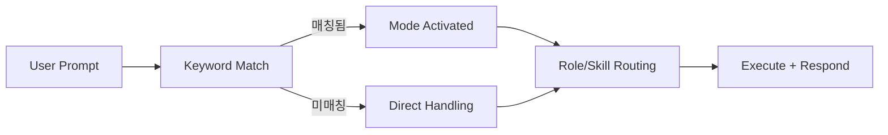

# 핵심 기능 02: Mode Detection

## 목적

사용자 자연어를 키워드 패턴으로 분류해 실행 모드와 워크플로우를 결정합니다.

## 관련 파일

- `AGENTS.md`의 `Mode Detection (자연어 트리거)` 섹션

## 동작 구조

## 대표 매핑 예시

- "끝까지", "완료할 때까지" → Ralph Mode
- "심층 분석", "deep search" → Deep Analysis
- "보안 검토", "security review" → Security Mode
- "테스트까지", "tdd" → QA/TDD Mode
- "도움말", "help" → Help

## 설계 포인트

- 단순 질문은 Direct Handling으로 오버헤드 최소화
- 복합 키워드는 역할 체인(예: Planner → Critic)으로 확장
- 모드 분류는 실행 전략 선택이며, 코드 내용 생성과 분리됨

## 검증 포인트

- 키워드가 `AGENTS.md` 표와 일치하는지 확인
- 새 키워드 추가 시 기존 키워드와 충돌 여부 확인
- 설명 문구와 실제 실행 스킬이 일치하는지 점검
