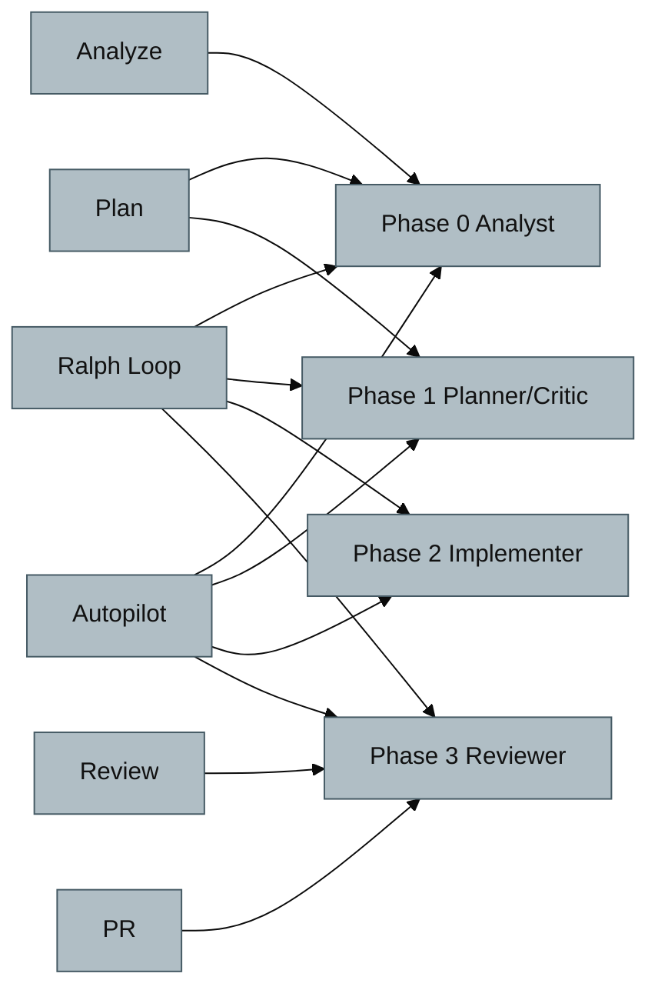

# 핵심 기능 04: Roles & Workflows

## 목적

`AGENTS.md` 기준으로 역할 전환 규칙과 워크플로우를 한 페이지에서 빠르게 확인합니다.

## 역할 맵 (Agent Roles)

총 15개 역할이 정의되어 있습니다.

| Phase | 역할 |
|---|---|
| Phase 0 | Analyst, Researcher, Vision |
| Phase 1 | Planner, Critic, Architect, Designer |
| Phase 2 | Implementer, Debugger, Migrator, TDD-Guide |
| Phase 3 | Reviewer, QA-Tester, Security-Reviewer, Doc-Writer |

## 워크플로우 맵 (Workflows)

총 10개 워크플로우가 정의되어 있습니다.

| 워크플로우 | 용도 |
|---|---|
| Ralph Loop | 완료까지 자율 반복 실행 |
| Autopilot | 4-Phase 자동 파이프라인 |
| Analyze | 심층 분석 |
| Plan | 요구사항 기반 기획/검토 |
| Review | 코드 리뷰 |
| PR | PR 생성 |
| Pipeline | 역할 순차 체이닝 |
| Clean | state 폴더 정리 |
| Stats | 스킬/워크플로우 사용 통계 |
| SOLID 분석 | 설계 품질 분석 |

## 역할-워크플로우 연결

## 선택 규칙 요약

- 단순 작업: Direct Handling
- 중간 복잡도: Implementer/Debugger → Reviewer
- 복잡 작업: 4-Phase (Analyze → Plan → Execute → Verify)
- 키워드 기반 강제 모드
  - `tdd`: TDD 워크플로우
  - `보안 검토`: Security-Reviewer
  - `문서화까지`: Doc-Writer/documentation

## 운영 팁

- 역할 전환이 필요한 작업은 문서에 role/phase를 명시해 요청하면 정확도가 높아집니다.
- 대규모 작업은 `Ralph` 또는 `Autopilot` 키워드로 실행 전략을 선명하게 지정합니다.
