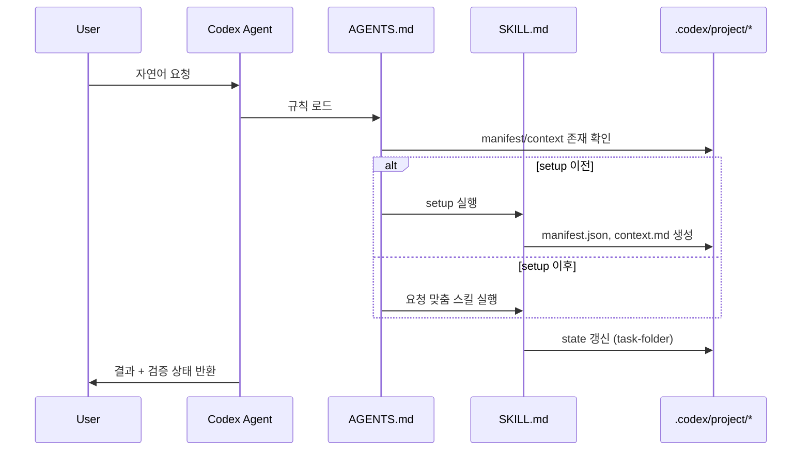

# 데이터 흐름

## 개요

이 저장소의 데이터는 비즈니스 데이터가 아니라,
요청 해석 결과와 `.codex/project/*` 상태 파일입니다.

## 요청 처리 시퀀스

## 상태 파일 라이프사이클

| 단계 | 파일 | 설명 |
|---|---|---|
| 입력 | `.codex/project/manifest.json` | setup 후 프로젝트 메타 |
| 입력 | `.codex/project/context.md` | setup 후 프로젝트 컨텍스트 |
| 처리 | `.codex/project/state/*` | 루프 작업별 상태 |
| 기준 | `.codex/project/manifest.json.template` | setup 생성 기준 템플릿 |
| 기준 | `.codex/project/VERSION` | 커널 버전 |

## 검증 포인트

- `doctor`
  - manifest 필수 키
  - skill frontmatter
  - 경로 참조 무결성
  - AGENTS-스킬 교차 참조
- `setup`
  - `manifest.json`, `context.md` 생성
- `evolve`
  - 변경된 프로젝트 상태를 문맥 파일에 반영

## 실패 시 기본 경로

1. `manifest.json` 없음: setup 실행
2. 경로 참조 오류: doctor 경고/오류 기준으로 수정
3. 구조 변경 후 불일치: evolve 또는 수동 갱신
