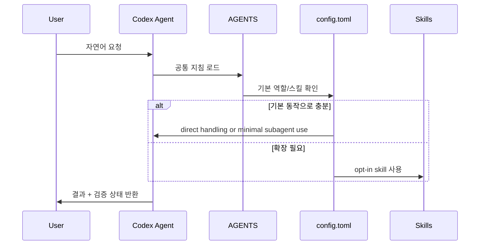

# 데이터 흐름

## 개요

현재 기본 템플릿의 핵심 데이터는 사용자 요청, 지침 파일, 설정 파일입니다.
`manifest.json`, `context.md`는 선택형 데이터입니다.

## 기본 처리 흐름

```mermaid
sequenceDiagram
    participant User as User
    participant Agent as Codex Agent
    participant Rules as AGENTS
    participant Config as config.toml
    participant Skills as Skills

    User->>Agent: 자연어 요청
    Agent->>Rules: 공통 지침 로드
    Rules->>Config: 기본 역할/스킬 확인
    alt 기본 동작으로 충분
        Config->>Agent: direct handling or minimal subagent use
    else 확장 필요
        Config->>Skills: opt-in skill 사용
    end
    Agent->>User: 결과 + 검증 상태 반환
```

## 선택형 상태 파일

- `.codex/project/manifest.json`
- `.codex/project/context.md`
- `.codex/project/state/*`

위 파일들은 특정 setup/loop 워크플로우가 필요할 때만 사용합니다.
